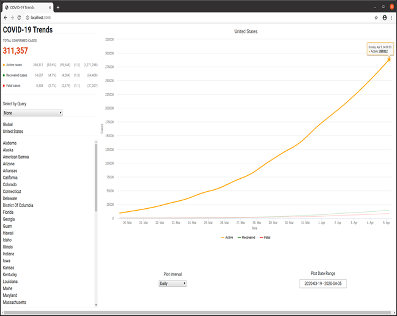

# README

This repository contains my semester graduate project for CSCI 601, Data Modeling and Database Design, at The Citadel. The project implements a web site that allows users to view a graphs of the current trends in COVID-19 case data.  It was built using Ruby on Rails using JetBrain's RubyMine IDE. The web server periodically pulls data from Microsoft's bing.com/covid site and stores it in a Postgres database.  Users can connect to the webserver via a browswer to request various views of the COVID-19 case data - active, recovered, and fatal.  The webserver accesses the database to retrieve the required data necessary to build the requested views.  As the web server pulls new data, any connected clients views are automatically and asynchronously updated with the latest data.

* Allows any area for which data exists (globally) to be selected and have its current COVID-19 case data plotted
* Specific areas can be selected by clicking on the area.  If the area is subdivided into smaller areas, those can be selected in turn. The larger area can be returned to by deselecting the smaller area under it.
* Data is shown for active, recovered, and fatal cases
* A tabular summary of the selected area at the end of the selected date range provides:
    * total number of cases 
    * percentage of total confirmed cases they represent 
    * case increase over the last 48 hours
    * rate of increase over the last 96 hours (the slope of the graph, with numbers < 1 indicating a flattening of the curve)
    * a rough prediction of the case totals in 8 days (assuming current rate of increase remains constant over the period, 𝑐_𝑛=𝑐_0 (1+𝑎)^𝑛, where 𝑐_0 is the number of cases today, 𝑛 is the number of periods (period covers 96 hours here, so 𝑛 = 2), and 𝑎 is the rate of increase per period.)
* A pulldown of canned queries can be used to select an area within the currently selected area (Select by Query), e.g. Highest Active Cases.
* For the currently selected area, a multiline plot of the case data (active, recovered, fatal) is displayed for the dates within the selected date range.  The earliest data available is March 19 when I started my collection activities.
* The granularity of the plot can be selected (Plot Interval)
* The date range for the plot can be selected (Plot Date Range)
